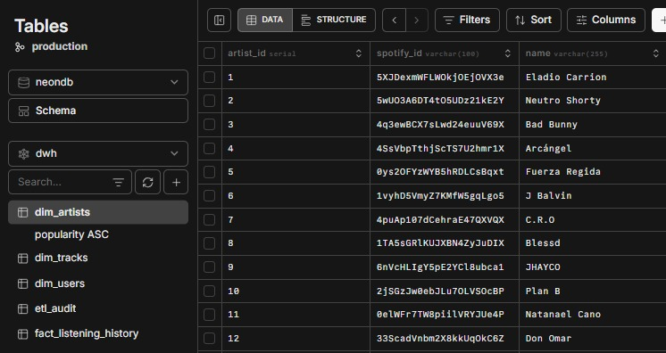
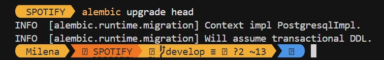

# DDL & Migrations

## What was implemented

The complete database schema managed through Alembic migrations. Running `alembic upgrade head` on an empty database creates all tables from scratch. The schema follows a Galaxy Schema (Snowflake variant) with one dimension-to-dimension FK: `dim_tracks.artist_id → dim_artists`.

### Schema Design

| Table | Schema | Type | Purpose |
|-------|--------|------|---------|
| `dim_users` | `dwh` | Dimension | Spotify user profile + OAuth tokens |
| `dim_artists` | `dwh` | Dimension | Top artists with `genres TEXT[]` |
| `dim_tracks` | `dwh` | Dimension | Top tracks with FK to `dim_artists` |
| `fact_listening_history` | `dwh` | Fact | One row per play event, `UNIQUE(user_id, played_at)` |
| `etl_audit` | `dwh` | Audit | Every ETL execution with metrics and cursors |
| `pkce_sessions` | `public` | Operational | OAuth PKCE state (single use) |

### Complete DDL Script

Produces the same result as `alembic upgrade head`:

```sql
CREATE SCHEMA IF NOT EXISTS dwh;

CREATE TABLE dwh.dim_users (
    user_id               SERIAL PRIMARY KEY,
    spotify_id            VARCHAR(100) UNIQUE NOT NULL,
    display_name          VARCHAR(255),
    email                 VARCHAR(255),
    country               VARCHAR(10),
    followers             INT,
    product               VARCHAR(20),
    spotify_access_token  TEXT,
    spotify_refresh_token TEXT,
    token_expires_at      TIMESTAMP,
    loaded_at             TIMESTAMP DEFAULT CURRENT_TIMESTAMP
);

CREATE TABLE public.pkce_sessions (
    state       VARCHAR(128) PRIMARY KEY,
    verifier    TEXT NOT NULL,
    created_at  TIMESTAMP DEFAULT CURRENT_TIMESTAMP
);

CREATE TABLE dwh.dim_artists (
    artist_id       SERIAL PRIMARY KEY,
    spotify_id      VARCHAR(100) UNIQUE NOT NULL,
    name            VARCHAR(255) NOT NULL,
    popularity      INT,
    followers_count INT,
    genres          TEXT[],
    loaded_at       TIMESTAMP DEFAULT CURRENT_TIMESTAMP
);

CREATE TABLE dwh.dim_tracks (
    track_id    SERIAL PRIMARY KEY,
    spotify_id  VARCHAR(100) UNIQUE NOT NULL,
    name        VARCHAR(255) NOT NULL,
    artist_id   INT REFERENCES dwh.dim_artists(artist_id),
    album_name  VARCHAR(255),
    duration_ms INT,
    popularity  INT,
    explicit    BOOLEAN,
    loaded_at   TIMESTAMP DEFAULT CURRENT_TIMESTAMP
);

CREATE TABLE dwh.fact_listening_history (
    id            SERIAL PRIMARY KEY,
    user_id       INT NOT NULL REFERENCES dwh.dim_users(user_id),
    track_id      INT NOT NULL REFERENCES dwh.dim_tracks(track_id),
    artist_id     INT NOT NULL REFERENCES dwh.dim_artists(artist_id),
    played_at     TIMESTAMP NOT NULL,
    hour_of_day   INT,
    day_of_week   VARCHAR(10),
    context_type  VARCHAR(50),
    UNIQUE (user_id, played_at)
);

CREATE TABLE dwh.etl_audit (
    audit_id         SERIAL PRIMARY KEY,
    spotify_user_id  VARCHAR(100) NOT NULL,
    started_at       TIMESTAMP NOT NULL,
    finished_at      TIMESTAMP,
    duration_ms      INT,
    status           VARCHAR(20) NOT NULL,
    error_message    TEXT,
    users_new        INT DEFAULT 0,
    artists_new      INT DEFAULT 0,
    artists_skipped  INT DEFAULT 0,
    tracks_new       INT DEFAULT 0,
    tracks_skipped   INT DEFAULT 0,
    history_new      INT DEFAULT 0,
    history_skipped  INT DEFAULT 0,
    cursor_after_ms  BIGINT,
    cursor_next_ms   BIGINT
);
```

### Alembic Configuration

`alembic/env.py` reads `DATABASE_URL` from `.env` via `python-dotenv` — credentials are never hardcoded in `alembic.ini`.

```bash
alembic init alembic                          # one time only
alembic upgrade head                          # apply to Neon
alembic downgrade -1                          # rollback one version
```

### Key Design Decisions

1. **`UNIQUE(user_id, played_at)` on `fact_listening_history`** — Guarantees idempotency. Running the ETL twice never creates duplicate play events.

2. **`genres TEXT[]` on `dim_artists`** — Uses PostgreSQL native arrays instead of a separate `dim_genres` table. Enables `UNNEST()` queries in the EDA without extra JOINs.

3. **`dim_tracks.artist_id` FK to `dim_artists`** — Creates a snowflake element. In a pure star schema this would be denormalized, but the FK was kept for referential integrity and simpler ETL.

4. **`pkce_sessions` in `public` schema** — Operational table, not analytical. Rows are deleted after single use during the OAuth callback.

5. **`etl_audit.cursor_next_ms`** — Stores `MAX(played_at)` as Unix milliseconds after each successful run. Used by the next ETL execution to call `/recently-played?after=<cursor>` and only fetch new plays.

## Screenshots





## Prompt used

```
Create the initial Alembic migration with the complete DDL as defined in workshop_definitions.md.
The migration file must:
1. Create the dwh schema
2. Create tables in dependency order: dim_users first, then pkce_sessions (public schema),
   then dim_artists, then dim_tracks (FK to dim_artists), then fact_listening_history
   (FK to dim_users, dim_tracks, dim_artists) with UNIQUE(user_id, played_at),
   then etl_audit with cursor_after_ms and cursor_next_ms as BIGINT
3. The downgrade() function must drop everything in reverse order respecting FK constraints
4. alembic/env.py must read DATABASE_URL from .env using python-dotenv, never hardcode it
```

## Prompting technique applied

**Chain of Thought** — The AI was guided step by step through the DDL creation in dependency order: schema first, then dimensions ordered by FK dependencies, then fact table with all constraints, then audit table. This order is critical because PostgreSQL enforces FK constraints at creation time — creating `dim_tracks` before `dim_artists` would fail.