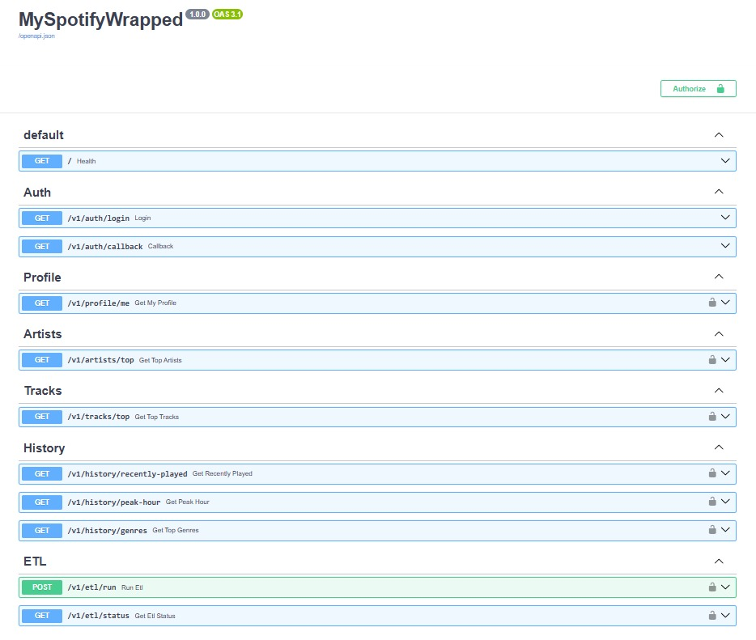
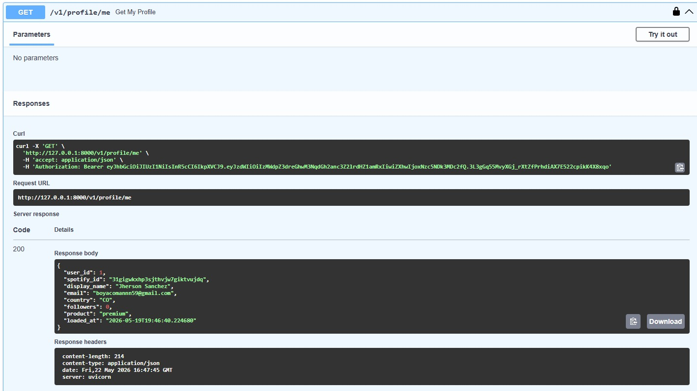
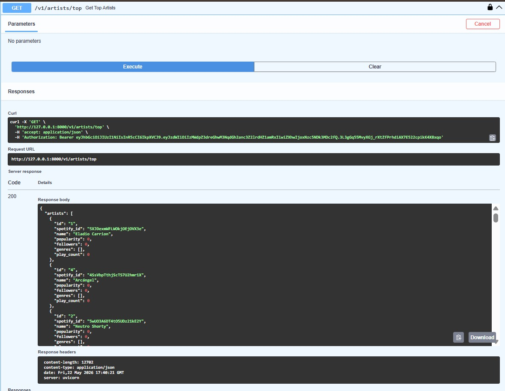
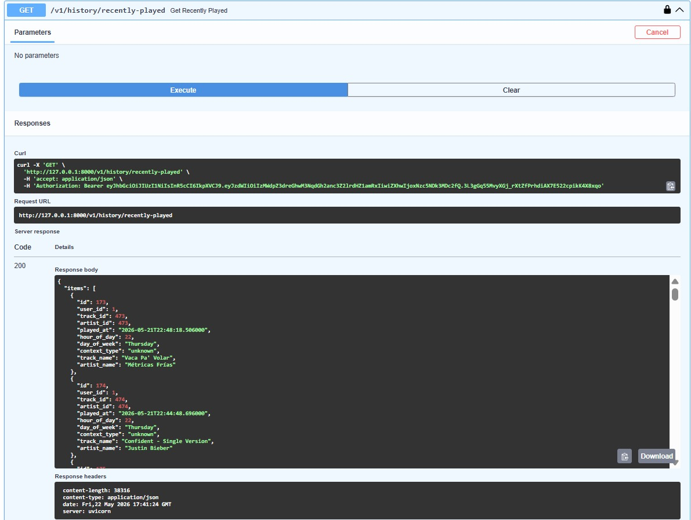
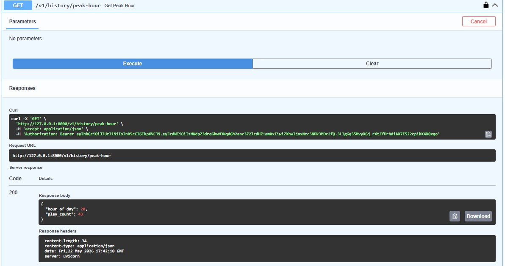
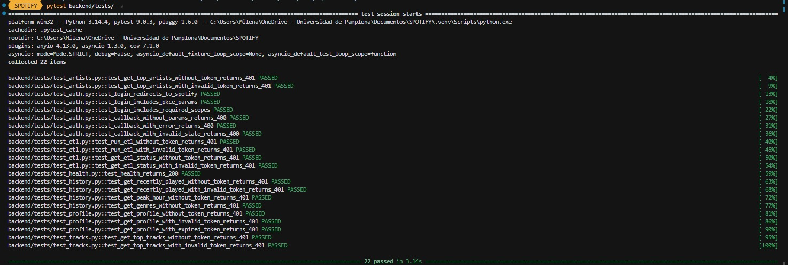
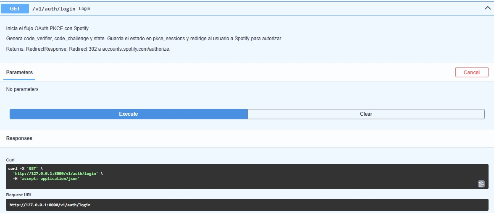
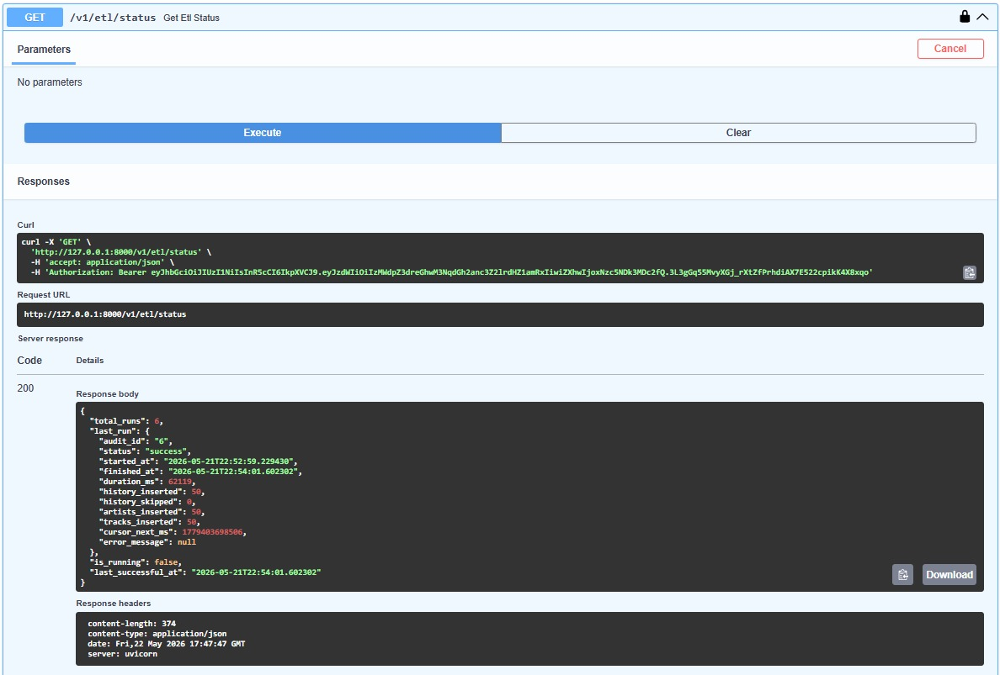

# Backend Implementation

## What was implemented

A complete FastAPI backend with OAuth PKCE authentication, JWT-protected endpoints, a centralized Spotify API client using `httpx`, and Pydantic v2 schemas. The backend follows a strict layered architecture as defined in `workshop_definitions.md`.

### Architecture

```
backend/
├── main.py                          ← FastAPI entry point + CORS
└── app/
    ├── core/
    │   ├── config.py                ← pydantic-settings (reads .env)
    │   ├── database.py              ← SQLAlchemy engine, session, get_db()
    │   └── spotify_client.py        ← centralized httpx client
    └── v1/
        ├── api.py                   ← groups all routers under /v1
        ├── dependencies.py          ← get_current_user (JWT validation)
        ├── routers/
        │   ├── auth.py              ← GET /v1/auth/login, GET /v1/auth/callback
        │   ├── profile.py           ← GET /v1/profile/me
        │   ├── artists.py           ← GET /v1/artists/top
        │   ├── tracks.py            ← GET /v1/tracks/top
        │   ├── history.py           ← GET /v1/history/recently-played, peak-hour, genres
        │   └── etl.py               ← POST /v1/etl/run, GET /v1/etl/status
        ├── schemas/                 ← Pydantic Base/Request/Response per entity
        └── services/                ← SQL queries and business logic
```

### OAuth PKCE Flow

The authentication uses Spotify's Authorization Code with PKCE — secure for SPAs, no client secret exposed to the browser.

```
GET /v1/auth/login
    ↓ Backend generates verifier (64 bytes) + challenge (SHA-256 BASE64URL) + state (UUID)
    ↓ Saves {state → verifier} in public.pkce_sessions
    ↓ 302 redirect → accounts.spotify.com/authorize?code_challenge=X&state=Y

User approves in Spotify
    ↓ Spotify 302 → /v1/auth/callback?code=X&state=Y

GET /v1/auth/callback
    ↓ Validates state against pkce_sessions, retrieves verifier, deletes row (single use)
    ↓ POST accounts.spotify.com/api/token (code + verifier → access_token + refresh_token)
    ↓ GET api.spotify.com/v1/me → user profile
    ↓ UPSERT dim_users (tokens, profile, token_expires_at)
    ↓ Issues app JWT: {sub: spotify_id, exp: now+8h} signed with SECRET_KEY (HS256)
    ↓ 302 redirect → FRONTEND_URL/callback?token=<jwt>
```

### JWT Protection

`dependencies.py` exports `get_current_user` — a FastAPI dependency that:
1. Reads `Authorization: Bearer <token>` header
2. Decodes the JWT with `python-jose` and `SECRET_KEY`
3. Extracts `spotify_id` from the `sub` claim
4. Returns `spotify_id` to the route handler
5. Raises HTTP 401 if token is invalid or expired

All data endpoints use `Depends(get_current_user)`.

### Endpoints

| Method | Route | Protected | Description |
|--------|-------|-----------|-------------|
| GET | `/v1/auth/login` | No | Initiates PKCE, redirects to Spotify |
| GET | `/v1/auth/callback` | No | Processes callback, issues JWT |
| GET | `/v1/profile/me` | Yes | User profile from `dim_users` |
| GET | `/v1/artists/top` | Yes | Top artists from `dim_artists` |
| GET | `/v1/tracks/top` | Yes | Top tracks with artist name |
| GET | `/v1/history/recently-played` | Yes | Listening history from fact table |
| GET | `/v1/history/peak-hour` | Yes | Hour with most plays |
| GET | `/v1/history/genres` | Yes | Top genres via `UNNEST` |
| POST | `/v1/etl/run` | Yes | Executes full ETL pipeline |
| GET | `/v1/etl/status` | Yes | DWH table counts and last runs |

### Pydantic Schemas (Rule 1)

Every entity has three classes: `Base` (shared fields), `Request` (input), `Response` (output with DB fields like `id` and `loaded_at`). Response classes use `model_config = ConfigDict(from_attributes=True)`.

### Token Refresh

Before each ETL execution, `routers/etl.py` checks `token_expires_at` in `dim_users`. If the Spotify token expires within 5 minutes, it automatically calls `refresh_access_token()` via `spotify_client.py` and updates `dim_users`.

### Spotify API Limitation

During development, we discovered that the Spotify Web API does not return `popularity`, `followers_count`, or `genres` for applications in development mode. The data model and ETL handle these fields correctly when available, but they are currently 0 or empty due to this API restriction. This is a Spotify limitation, not a code issue.

## Screenshots

















## Prompt used

```
You are a senior FastAPI developer. Build the complete backend for the Spotify Wrapped DWH
following workshop_definitions.md exactly. Implement:
1. OAuth PKCE flow: auth_service.py with verifier/challenge/state generation, pkce_sessions
   management (single use), token exchange, dim_users UPSERT, JWT emission (HS256, 8h expiry)
2. JWT middleware: dependencies.py with get_current_user using python-jose, returns spotify_id
3. Spotify client: spotify_client.py using httpx (async) for all 6 endpoints
4. Protected endpoints for profile, artists, tracks, history (recently-played, peak-hour, genres)
5. ETL router with automatic token refresh when token expires in < 5 minutes
6. Pydantic schemas with Base/Request/Response pattern, ConfigDict(from_attributes=True)
7. All imports prefixed with backend.app (uvicorn runs from project root)
8. Docstrings with Args/Returns following Rules 3 and 4 from workshop_definitions.md
```

## Prompting technique applied

**Iterative Prompting** — The backend was built phase by phase, testing each before continuing. Issues found during real testing were fixed with targeted prompts:
- Fix 1: `offset-naive vs offset-aware` datetime comparison in token expiry check
- Fix 2: Missing artists/tracks from `recently-played` not found in dimensions
- Fix 3: Routers had placeholder implementations instead of calling services
- Fix 4: `artist_id NULL` in some tracks due to loading order

Each fix was a separate targeted prompt describing the exact error and expected behavior.