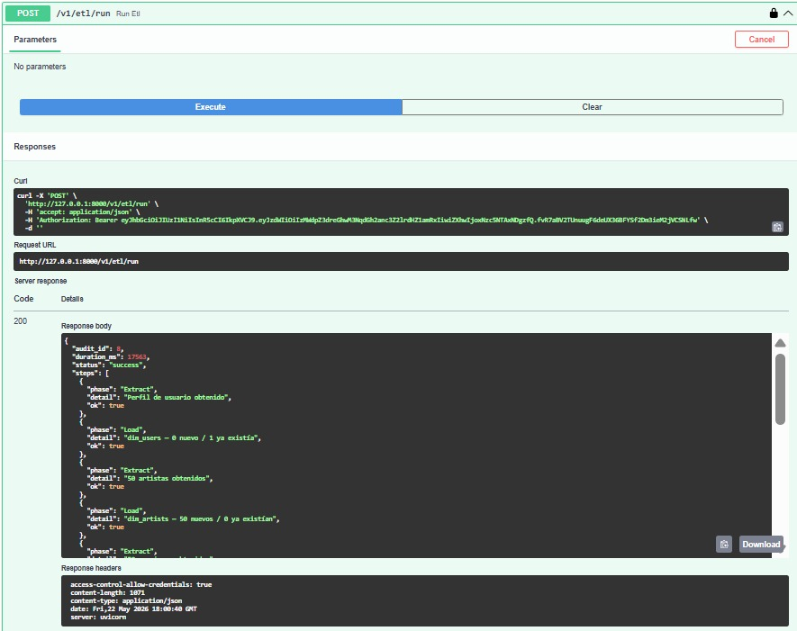
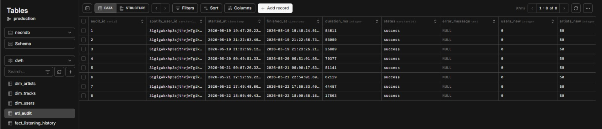
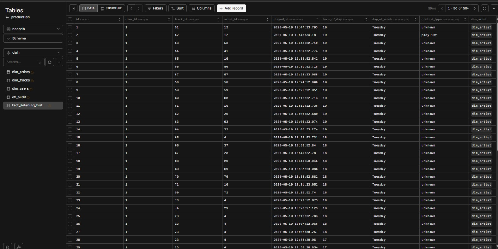
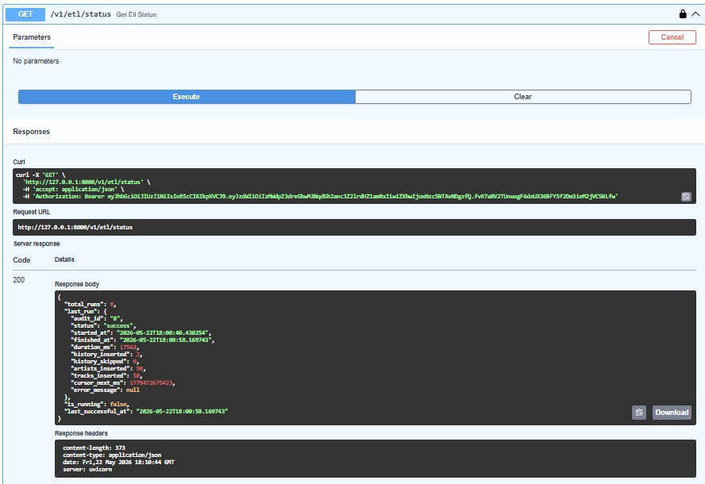

# ETL Pipeline

## What was implemented

A complete ETL pipeline in `backend/app/v1/services/etl_service.py` with the 3 phases clearly separated as individual functions with full docstrings (Rules 3 and 4). The pipeline runs via `POST /v1/etl/run` and writes a complete audit record to `etl_audit` after every execution.

### File Structure

All ETL logic lives in one file organized in 4 clear sections:

```
etl_service.py
├── # EXTRACT — calls Spotify API, returns raw JSON, no logic
│   ├── extract_user(token)
│   ├── extract_top_artists(token)
│   ├── extract_top_tracks(token)
│   └── extract_recently_played(token, after)
│
├── # TRANSFORM — normalizes raw data for the dimensional model
│   ├── transform_user(raw)
│   ├── transform_artists(raw_list)
│   ├── transform_tracks(raw_list)
│   └── transform_history(raw_items)
│
├── # LOAD — inserts into PostgreSQL with ON CONFLICT
│   ├── load_user(data, db)
│   ├── load_artists(data_list, db)
│   ├── load_tracks(data_list, db)
│   └── load_history(data_list, spotify_id, db)
│
└── # PIPELINE — orchestrates all phases in order
    ├── insert_audit_start(spotify_user_id, db)
    ├── get_last_cursor(spotify_user_id, db)
    ├── update_audit_success(audit_id, duration_ms, cursors, metrics, db)
    ├── update_audit_error(audit_id, duration_ms, error_message, db)
    └── run_etl_pipeline(token, spotify_id, db)
```

### Phase 1 — Extract

Extract functions call Spotify via `spotify_client.py` (httpx async) and return raw JSON. No transformations happen in this phase.

| Function | Spotify Endpoint | Returns |
|----------|-----------------|---------|
| `extract_user(token)` | `GET /v1/me` | `dict` — raw profile |
| `extract_top_artists(token)` | `GET /v1/me/top/artists?limit=50` | `list[dict]` — raw artists |
| `extract_top_tracks(token)` | `GET /v1/me/top/tracks?limit=50` | `list[dict]` — raw tracks |
| `extract_recently_played(token, after)` | `GET /v1/me/player/recently-played?limit=50` | `list[dict]` — raw play history |

### Phase 2 — Transform

Transform functions normalize raw Spotify JSON into the dimensional model format.

| Field | Transformation applied |
|-------|----------------------|
| `played_at` | `datetime.fromisoformat(value.replace("Z", "+00:00"))` |
| `hour_of_day` | `played_at.hour` (UTC) |
| `day_of_week` | `played_at.strftime("%A")` |
| `context_type` | `(item.get("context") or {}).get("type") or "unknown"` |
| `genres` | Stored as-is in `TEXT[]` |
| `artist_id` FK | Resolved by querying `dim_artists.spotify_id` |

### Phase 3 — Load

All load functions use `ON CONFLICT` for idempotency:

```sql
-- Dimensions (update if data was empty)
INSERT INTO dwh.dim_artists (spotify_id, name, popularity, followers_count, genres)
VALUES (:spotify_id, :name, :popularity, :followers_count, :genres)
ON CONFLICT (spotify_id) DO UPDATE SET
    popularity = EXCLUDED.popularity,
    followers_count = EXCLUDED.followers_count,
    genres = EXCLUDED.genres
WHERE dwh.dim_artists.popularity = 0;

-- Fact table (never duplicate a play event)
INSERT INTO dwh.fact_listening_history
    (user_id, track_id, artist_id, played_at, hour_of_day, day_of_week, context_type)
VALUES (:user_id, :track_id, :artist_id, :played_at, :hour_of_day, :day_of_week, :context_type)
ON CONFLICT (user_id, played_at) DO NOTHING;
```

### Dimension Completeness Strategy

`recently-played` returns tracks and artists that may not be in the user's top 50. Before loading `fact_listening_history`, the pipeline iterates through each history item and inserts missing artists and tracks into the dimensions with `ON CONFLICT DO NOTHING`. This guarantees all FKs can be resolved.

Similarly, `load_tracks` creates missing artists on-the-fly when a top track references an artist not yet in `dim_artists`.

### Incremental Loading with Cursor

```
Execution 1 (no previous runs):
  cursor_after_ms = None
  GET /recently-played?limit=50  ← no after parameter
  Loads all 50 most recent plays
  cursor_next_ms = MAX(played_at) as Unix ms → saved in etl_audit

Execution 2+:
  cursor_after_ms = cursor_next_ms from last successful etl_audit
  GET /recently-played?limit=50&after=<cursor_after_ms>
  Only returns plays newer than cursor
  ON CONFLICT (user_id, played_at) DO NOTHING protects against duplicates
```

### Audit Trail

Every execution writes to `etl_audit`:

| Field | When written |
|-------|-------------|
| `started_at` + `status='running'` | At pipeline start |
| `finished_at`, `duration_ms`, `status='success'` | On success |
| `status='error'`, `error_message` | On any exception |
| `users_new`, `artists_new/skipped`, `tracks_new/skipped`, `history_new/skipped` | Counts per phase |
| `cursor_after_ms` | Cursor used in this run |
| `cursor_next_ms` | `MAX(played_at)` → cursor for next run |

### Sample ETL Output

```json
{
  "audit_id": 2,
  "duration_ms": 53059,
  "status": "success",
  "steps": [
    {"phase": "Extract", "detail": "Perfil de usuario obtenido", "ok": true},
    {"phase": "Load", "detail": "dim_users — 0 nuevo / 1 ya existía", "ok": true},
    {"phase": "Extract", "detail": "50 artistas obtenidos", "ok": true},
    {"phase": "Load", "detail": "dim_artists — 50 nuevos / 0 ya existían", "ok": true},
    {"phase": "Extract", "detail": "50 canciones obtenidas", "ok": true},
    {"phase": "Load", "detail": "dim_tracks — 50 nuevos / 0 ya existían", "ok": true},
    {"phase": "Extract", "detail": "22 reproducciones recientes obtenidas", "ok": true},
    {"phase": "Transform", "detail": "Artistas y tracks del historial asegurados en dimensiones", "ok": true},
    {"phase": "Transform", "detail": "Timestamps normalizados, géneros procesados", "ok": true},
    {"phase": "Load", "detail": "fact_listening_history — 22 nuevos / 0 ya existían", "ok": true},
    {"phase": "Audit", "detail": "Auditoría registrada — duración: 53.06 s", "ok": true}
  ],
  "metrics": {
    "users_new": 0,
    "artists_new": 50,
    "artists_skipped": 0,
    "tracks_new": 50,
    "tracks_skipped": 0,
    "history_new": 22,
    "history_skipped": 0
  }
}
```

### ETL Execution Log (etl_audit table)

| audit_id | started_at | history_new | cursor_after_ms | cursor_next_ms | status |
|----------|-----------|-------------|-----------------|----------------|--------|
| 3 | 2026-05-19 19:47:29 | 50 | NULL | 1779220043703 | success |
| 2 | 2026-05-19 21:22:03 | 22 | 1779220043703 | 1779225687198 | success |
| 1 | 2026-05-19 21:22:59 | 0 | 1779225687198 | NULL | success |

The cursor chain shows correct incremental loading: each run only fetches plays since the last cursor.

## Screenshots









## Prompt used

```
Create the complete ETL service in etl_service.py with all 3 phases strictly separated:
- extract_* functions: call spotify_client.py and return raw JSON only, no transformations
- transform_* functions: normalize timestamps with fromisoformat, derive hour_of_day (played_at.hour),
  day_of_week (strftime %A), context_type from nested dict safely with .get()
- load_* functions: ON CONFLICT for idempotency on all tables; resolve all FKs before inserting fact
- Before loading history, insert missing artists and tracks from recently-played items into dimensions
- Incremental loading: get cursor_next_ms from last successful etl_audit, pass as after parameter
- Audit: insert_audit_start sets status='running', update_audit_success writes metrics and cursors,
  update_audit_error captures exception message, all with db.commit()
- run_etl_pipeline: orchestrates all phases in order with try/except and db.rollback() on error
All functions need docstrings with Args and Returns following Rules 3 and 4.
```

## Prompting technique applied

**Chain of Thought + Iterative Prompting** — The ETL was built incrementally. First extract functions, then transform, then load, then the pipeline orchestration. Each phase was tested with real Spotify data before moving on. Three bugs were found and fixed through targeted iterations:

1. Only 2 records in `fact_listening_history` → Fix: insert missing dimension records from history before loading fact table
2. `artist_id NULL` in `dim_tracks` → Fix: `load_tracks` now creates missing artist on-the-fly
3. `ON CONFLICT DO NOTHING` losing popularity updates → Fix: changed to `DO UPDATE WHERE popularity = 0`