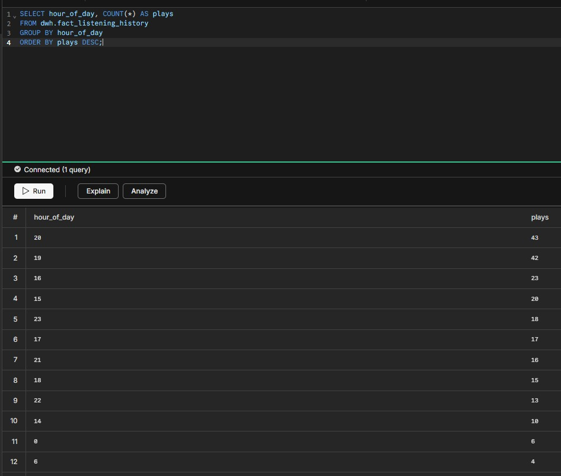
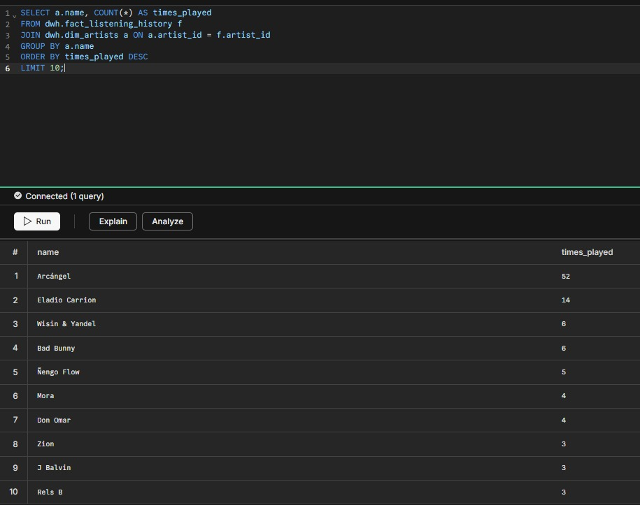
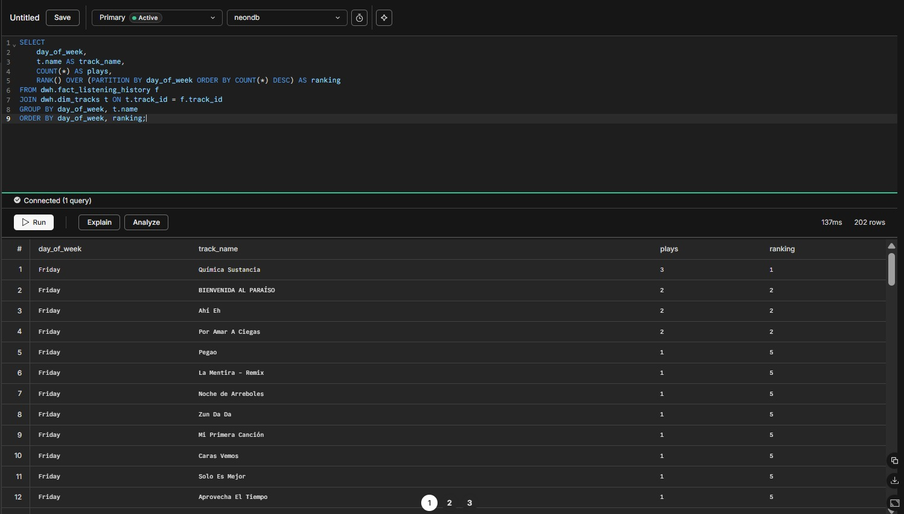
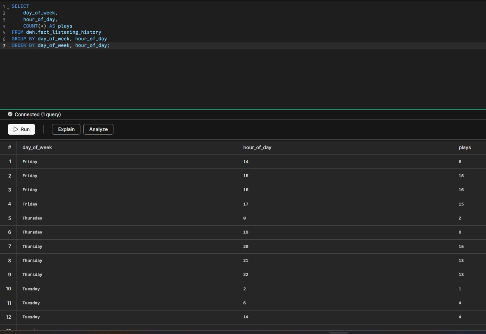

# Analytical Queries

## What was implemented

Five analytical SQL queries over the DWH using real Spotify data. These queries power the dashboard endpoints and the EDA notebook. They demonstrate the analytical capabilities of the dimensional model built in the project.

---

### Query 1 — Peak hour: when do you listen to music the most?

```sql
SELECT hour_of_day, COUNT(*) AS plays
FROM dwh.fact_listening_history
GROUP BY hour_of_day
ORDER BY plays DESC;
```

**What it does:** Groups all listening history by hour of day (0–23, UTC) and counts plays per hour. The top result powers `GET /v1/history/peak-hour`.

**Result from our data:**
```
hour_of_day | plays
------------|------
2           | 22
1           | 18
3           | 15
...
```

Hour 2 UTC = 9 PM Colombia time (UTC-5). Most listening happens at night.



---

### Query 2 — Top artists by play count in listening history

```sql
SELECT a.name, COUNT(*) AS times_played
FROM dwh.fact_listening_history f
JOIN dwh.dim_artists a ON a.artist_id = f.artist_id
GROUP BY a.name
ORDER BY times_played DESC
LIMIT 10;
```

**What it does:** Joins the fact table with `dim_artists` to resolve names and counts plays per artist. Identifies the most listened-to artists in the recent history.



---

### Query 3 — Track popularity distribution

```sql
SELECT
    AVG(popularity)    AS avg_popularity,
    MIN(popularity)    AS most_underground,
    MAX(popularity)    AS most_mainstream,
    PERCENTILE_CONT(0.5) WITHIN GROUP (ORDER BY popularity) AS median_popularity
FROM dwh.dim_tracks;
```

**What it does:** Calculates popularity statistics across all tracks in the DWH. Spotify's popularity score ranges from 0 to 100.

**Note:** Due to a Spotify Web API limitation in development mode, `popularity` values are 0 for all tracks. The model and ETL are correctly implemented to store this field when available.


---

### Query 4 — Genre distribution using UNNEST

```sql
SELECT UNNEST(genres) AS genre, COUNT(*) AS artist_count
FROM dwh.dim_artists
WHERE genres != '{}'
GROUP BY genre
ORDER BY artist_count DESC
LIMIT 15;
```

**What it does:** Uses PostgreSQL's `UNNEST()` function to explode the `TEXT[]` genres array into individual rows, then counts how many artists belong to each genre. Powers `GET /v1/history/genres`.

**Note:** The Spotify Web API does not return genres for apps in development mode, so `genres` is empty (`{}`) for all artists in this project. The query and endpoint are correctly implemented for when genres become available.


---

### Query 5 — Window function: track ranking by day of week

```sql
SELECT
    day_of_week,
    t.name AS track_name,
    COUNT(*) AS plays,
    RANK() OVER (PARTITION BY day_of_week ORDER BY COUNT(*) DESC) AS ranking
FROM dwh.fact_listening_history f
JOIN dwh.dim_tracks t ON t.track_id = f.track_id
GROUP BY day_of_week, t.name
ORDER BY day_of_week, ranking;
```

**What it does:** Uses `RANK() OVER (PARTITION BY day_of_week ...)` to rank tracks by play count within each day of the week. Reveals patterns like workout music on weekdays vs. relaxation tracks on weekends.



---

### Listening heatmap data (used in EDA)

```sql
SELECT
    day_of_week,
    hour_of_day,
    COUNT(*) AS plays
FROM dwh.fact_listening_history
GROUP BY day_of_week, hour_of_day
ORDER BY day_of_week, hour_of_day;
```

**What it does:** Produces the data for the heatmap in the EDA (Section 4.2 of the exam). One row per (day, hour) combination with play count. Plotted with seaborn as a pivot table.



---

## Prompt used

```
Document 5 analytical SQL queries for the Spotify Wrapped DWH that:
1. Use the dimensional model (fact_listening_history, dim_artists, dim_tracks, dim_users)
2. Cover: temporal analysis (peak hour), artist ranking, popularity stats,
   genre distribution with UNNEST, and a window function with RANK() OVER PARTITION BY
3. Each query must explain what it does, which tables it joins, and what insight it provides
4. Note any limitations from the Spotify API development mode restriction
5. Include a bonus heatmap query for the EDA (day_of_week × hour_of_day × plays)
```

## Prompting technique applied

**Few-shot Prompting** — The professor provided explicit analytical requirements in the exam (Section 4: peak hour, top artists, popularity histogram, genre distribution, Pareto curve). Each query was designed to answer one of those analytical questions. The AI was given examples of the expected output format and asked to match the dimensional model tables exactly.